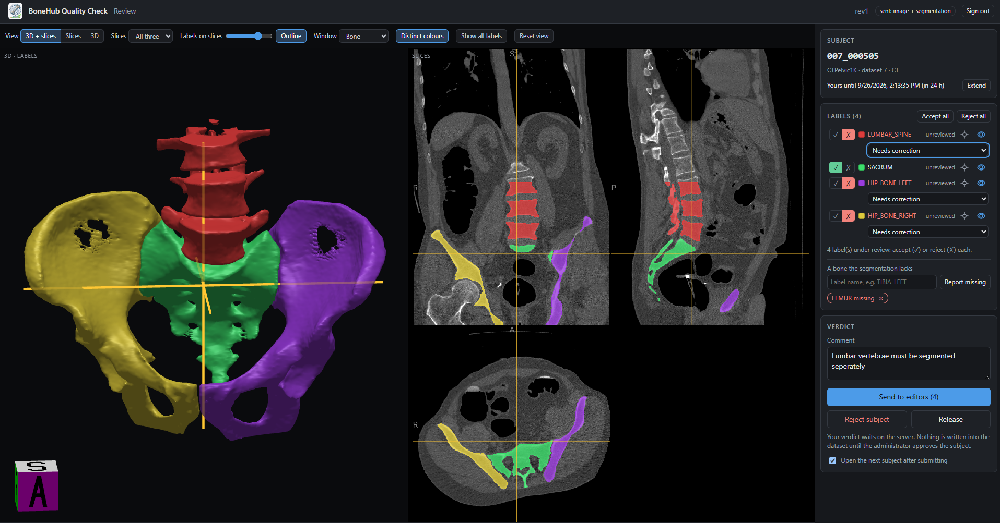

<p align="center">
  
</p>

<p align="center">
  
</p>

# BoneHub Quality Check — Server

This server runs a human quality check of the segmentations in a
[BoneHub Dataset](https://github.com/BoneHub/BoneHub-Dataset). It hands out subjects one at a
time to three kinds of people:

- **Reviewers** look at a segmentation in their web browser and accept or reject each bone
  (each *label*). They can also report bones that are missing.
- **Editors** fix what the reviewers rejected, in 3D Slicer.
- **You, the administrator,** approve the result. **Nothing is written into the dataset until
  you approve a subject.**

The server runs in Docker, on any computer that can reach the dataset folder, whether on a
local disk or an SMB share.

## Contents

- [How it works](#how-it-works)
- [Install and start](#install-and-start)
- [First-time setup](#first-time-setup)
- [The admin panel](#the-admin-panel)
- [Everyday tasks](#everyday-tasks)
- [Settings](#settings)
- [Users, roles and keys](#users-roles-and-keys)
- [Labels, stages and what approval writes](#labels-stages-and-what-approval-writes)
- [Running the server](#running-the-server)
- [Where the server keeps things](#where-the-server-keeps-things)
- [Troubleshooting](#troubleshooting)
- [What reviewers and editors see](#what-reviewers-and-editors-see)
- [For developers](#for-developers)

## How it works

### Who does what

| Who | Works in | Does |
| --- | --- | --- |
| Administrator | the admin panel, `http://<host>:8000/admin` | creates users, follows progress, approves results |
| Reviewer | the review page, `http://<host>:8000/review`, in any modern browser; nothing to install | accepts or rejects each label, reports missing bones |
| Editor | 3D Slicer, with the [BoneHub Quality Check extension](https://github.com/BoneHub/qc-slicer) | corrects rejected labels, adds missing bones, segments subjects that have no segmentation |

One person can be both a reviewer and an editor. The server never asks anyone to review their
own correction.

### The path of a subject

```
  new subject
      │
      ▼
   REVIEW ◄───────────────────────────────┐  the correction goes back to a reviewer
      │ a reviewer judges each label      │  (unless you switched that off)
      │                                   │
      ├── a label rejected or missing ──► EDIT ── editor cannot fix it ──► ESCALATED
      │                                   │                                (you decide)
      │ every label accepted              │ correction accepted on the editor's word
      ▼                                   │ (only when corrections need no review)
   APPROVAL ◄─────────────────────────────┘
      │ you approve
      ▼
   APPROVED: written into the dataset
```

1. **A reviewer judges the subject.** Each label is accepted, or rejected because it *needs
   correction* or *should not be there*. Bones the segmentation lacks are reported *missing*.
2. **If anything is rejected or missing, an editor corrects it** in 3D Slicer and uploads the
   corrected segmentation.
3. **A reviewer checks the correction.** The review page shows the editor's version. You can
   switch this step off: see [Should corrections go back to a reviewer?](#should-corrections-go-back-to-a-reviewer)
4. **You approve the subject** in the admin panel. Only then does the server update
   `Subject_info_XXX.json` and replace the dataset's segmentation with the correction. See
   [What approval writes](#what-approval-writes).

An editor who cannot fix a subject (the image is unusable, for example) sends it to you with
a comment. It then shows as *escalated*.

### Which subjects are handed out

- Every subject with at least one label of status `1` ("available, not reviewed") in its
  `Subject_info_XXX.json`. These go to reviewers first.
- Subjects with an image but no segmentation, only if you turn on **Queue subjects without
  segmentation**. These go straight to editors, to segment from scratch.
- Subjects already in progress are handed out before new ones.
- An approved subject is never handed out again by the same server.

## Install and start

### Requirements

- Docker with Compose v2 (Docker Desktop, or Docker Engine on Linux).
- Read and write access to the dataset folder: the folder that contains `Dataset_001`,
  `Dataset_002`, and so on, written with BoneHub data schema 0.3.

### Steps

```bash
git clone https://github.com/BoneHub/qc-server.git
cd qc-server
cp .env.example .env                          # then edit .env: say where the dataset is
docker compose up -d --build
docker compose exec bonehub-qc-server bonehub-qc-server show-admin-key # get the admin key if you have not already set in .env
```

Then open `http://<host>:8000/admin` and sign in with that key. `<host>` is the name or IP
address of the computer running Docker; use `localhost` on that computer itself.

### Tell the server where the dataset is

In `.env`, fill in **one** of the two options and leave the other blank:

| Dataset on | Variable | Example |
| --- | --- | --- |
| a disk of this computer | `BONEHUB_DATASET_PATH` | `C:/data/BoneHub_Dataset` |
| an SMB share | `BONEHUB_DATASET_SHARE` | `//192.168.0.10/Data/BoneHub/BoneHub_Dataset` |
| | `BONEHUB_SMB_USERNAME` | `alice` |
| | `BONEHUB_SMB_PASSWORD` | the share password |
| | `BONEHUB_SMB_OPTIONS` | `domain=AD,vers=3.0` |

- If both are filled in, the local folder is used. `docker compose` refuses to start when
  neither is, or when a share is missing its username or password.
- **A mapped network drive (`Z:`) is not a local folder.** Put its UNC path in
  `BONEHUB_DATASET_SHARE`. `net use` shows the UNC path behind each drive letter. Docker
  Desktop cannot mount a drive letter. Given one, it mounts an empty folder instead, and the
  server starts with `0 of 0 subjects`.
- A share password cannot contain a comma. Write a `$` in it as `$$`.
- **After changing the share or any `BONEHUB_SMB_…` value**, recreate the share's volume.
  This loses nothing, because the volume only holds the connection to the share. For a
  server with a [name of its own](#another-server-on-this-computer), write that name instead
  of `bonehub_qc`:

  ```bash
  docker compose down && docker volume rm bonehub_qc_dataset && docker compose up -d
  ```

### Update the server

```bash
git pull && docker compose up -d --build
```

The server keeps its admin key, its users and all work in progress.

**Update the 3D Slicer extension at the same time.** The extension refuses to connect to a
server of a different version (major.minor). If a new server version refuses to start on the
state an older one left behind, start a
[new server](#where-the-server-keeps-things).

## First-time setup

1. **Sign in.** Open `http://<host>:8000/admin` and enter the admin key printed at the first
   start. Lost it? See [The admin key](#the-admin-key).
2. **Check the dataset is found.** The **Queue** section shows *Subjects total* and
   *Eligible*. If both are 0, the dataset is not mounted: see
   [Troubleshooting](#troubleshooting).
3. **Check the policy.** The defaults suit a first quality check. The
   [Settings](#settings) section explains each one. Settings in `.env` win over the panel at
   every start.
4. **Create users** under **Create user**. Pick their roles and what they are sent. The key is
   shown **once**:
   - send a reviewer their **invite link**, which opens the review page already signed in;
   - send an editor their **key** and the server's address, `http://<host>:8000`.
5. **Editors install the extension.** Its
   [README](https://github.com/BoneHub/qc-slicer)
   explains how.
6. **If users connect from outside a trusted network, put HTTPS in front of the server.** Keys
   and images travel with every request.

## The admin panel

Open `http://<host>:8000/admin`. The panel keeps your key until you close the browser tab.

**Top buttons:**

- **Refresh** reloads every section.
- **Re-scan dataset** reads the dataset folder again right away. Otherwise the server does
  this every 5 minutes, so new subjects or changed `Subject_info` files show up within
  5 minutes.
- **Sign out** forgets the key in this tab.

### Queue

A count of subjects at each point of the quality check:

| Box | Counts subjects that… |
| --- | --- |
| Awaiting approval | have every label accepted and wait for you. Highlighted when above 0 |
| Escalated | an editor could not fix and sent to you. Highlighted when above 0 |
| To review | are in progress and wait for a reviewer |
| To edit | are in progress and wait for an editor |
| Out now | someone is working on right now |
| Not started | are eligible and nobody has looked at yet |
| Approved | you approved; they are written into the dataset |
| Closed | you closed without writing anything |
| On other servers | another server that uses this dataset has out or in progress |
| Eligible | match the queue policy |
| Subjects total | are in the dataset |

A subject someone is working on counts under *Out now*, not under its stage. Below the boxes,
the panel shows when the dataset was last read and how many eligible subjects each dataset has.

### Approvals

This is where you decide. The **Showing** menu picks what to list:

| Showing | Lists subjects that… |
| --- | --- |
| waiting for approval (default) | are ready for you to approve |
| sent to you by an editor | are escalated |
| waiting for a reviewer | are in progress, at a reviewer |
| waiting for an editor | are in progress, at an editor |
| approved | are finished and written into the dataset |
| closed | you closed |
| all | are in any of the above |

Each row shows:

- **Stage**: where the subject is.
- **Labels**: a summary such as "3 accepted · 1 to review". Click it to see every label: its
  state and who stands behind it, for example "accepted by rita, corrected by eddie". For a
  subject waiting for approval, the line below says what approving will write, for example
  "On approval: 3 set to 2".
- **Segmentation**: "the dataset's own" or "correction by eddie". **Download** saves it as a
  `.seg.nrrd` file, to open in 3D Slicer.
- **Latest**: the last step, who took it, and their comment.

The buttons:

| Button | What it does |
| --- | --- |
| **Approve** | Writes this subject into the dataset. Only for subjects waiting for approval |
| **Approve all waiting** | Approves every subject waiting for approval, and lists any it could not approve, with the reason |
| **To reviewers** | Sends the subject back to the reviewers: every verdict is reviewed again. You can add a comment |
| **To editors** | Sends the subject to an editor with your comment, for example what to fix |
| **Close** | Ends the quality check of this subject without writing anything. It is not handed out again unless you press To reviewers or To editors, which reopen it |

While someone is working on a subject, its buttons are replaced by "with *name*". To act on it
anyway, release it first under **Assignments**. An approved subject has no buttons: it is
finished.

### Create user and Users

**Create user** makes a new account: a name, its roles, which datasets it may see (blank means
all), what it is sent of each subject, and an optional note. **Create & issue key** shows the
key once, together with an invite link for a reviewer. See
[Users, roles and keys](#users-roles-and-keys).

The **Users** table lists every account:

| Column | Shows |
| --- | --- |
| Key | the first characters of the key, to tell keys apart |
| Status | active or disabled |
| Roles | reviewer, editor, or both. Change them here at any time |
| Open | subjects they hold right now |
| Reviewed / Edited | how many subjects they reviewed and corrected |
| Sent | what they are sent of each subject. Change it here at any time |
| Datasets | the datasets they may see |

The buttons:

- **New key** issues a new key. The old one stops working immediately.
- **Disable** blocks the account until you press **Enable**.
- **Delete** removes the account. Any subjects the user holds go back to the queue.

### Assignments

One row each time a subject was handed to someone:

| State | Meaning |
| --- | --- |
| assigned | the user has it right now |
| submitted | the user sent a verdict or a correction. The *Verdict* column says what it did and where the subject went |
| released | the user or you handed it back unfinished |
| expired | the lease ran out and the subject went back to the queue |

**Release** on an assigned row returns the subject to the queue now, for example when someone
is away. The **State** menu filters the list.

### Recent activity

The last 50 events: verdicts, corrections, approvals, subjects handed out, and changes to
users. Comments appear here too.

### Policy

The server's settings. Change them and press **Save policy**. They take effect at once, and the
dataset is re-scanned. See [Settings](#settings) for what each one does. A setting filled in
in `.env` comes back at the next restart.

## Everyday tasks

**Approve finished subjects.** Under **Approvals**, show *waiting for approval*. Open the
**Labels** summary to see who accepted what. If you want to look yourself, **Download** the
segmentation and open it in 3D Slicer. Then press **Approve**, or **Approve all waiting**.

**Deal with an escalated subject.** Show *sent to you by an editor* and read the editor's
comment under **Latest**. Then:

- **To editors**, with a comment saying what to do, if it can be fixed after all;
- **To reviewers**, if the verdicts should be looked at again;
- **Close**, if the subject cannot be used. Nothing is written into the dataset.

**Send back a subject that does not look right.** Before approving, press **To reviewers** (to
have every label judged again) or **To editors** (with a comment saying what to fix).

**Free a subject someone is holding.** A subject returns to the queue by itself when the lease
runs out, 24 hours by default. To free it sooner, press **Release** under **Assignments**.
Users can extend their own lease, from the review page or from 3D Slicer.

**Replace a lost or leaked key.** Press **New key** for that user and send them the new key or
invite link.

**Remove someone.** **Disable** blocks them for now. **Delete** removes them, and their open
subjects go back to the queue.

**Review subjects that were reviewed before.** Set **Eligible label statuses** to `1,2` under
**Policy**. Subjects with labels of status `2` then enter the queue as well. Subjects this
server has already approved are not handed out again.

**Have editors segment subjects that have no segmentation.** Turn on **Queue subjects without
segmentation**. These subjects go to editors only. An editor who is sent the image only can
segment them too.

**Check what happened to a subject.** Under **Approvals**, show *all* and open its **Labels**.
**Recent activity** and the [log files](#logs-and-audit-trail) have the full history.

## Settings

### Where settings come from

You can change a setting in two places:

- **The Policy section of the admin panel.** The change applies at once and is saved in the
  server's `config.json`.
- **`.env`**, as `BONEHUB_QC_<NAME>`. A value filled in there **wins over the panel at every
  start**, so a change you make in the panel is undone by the next restart or update. Leave a
  setting blank in `.env` to manage it from the panel. `.env.example` leaves every setting
  blank.

`docker-compose.yml` passes only some variables to the server:
`BONEHUB_QC_ELIGIBLE_LABEL_VALUES`, `BONEHUB_QC_LEASE_TTL_SECONDS`,
`BONEHUB_QC_MAX_CONCURRENT_ASSIGNMENTS_PER_USER`, `BONEHUB_QC_EDITS_NEED_REVIEW`,
`BONEHUB_QC_ALLOWED_DATASET_IDS` and the keys. To set any other setting from `.env`, also add
it to the `environment:` block of `docker-compose.yml`, the same way as the others.

### All settings

| In the panel | In `.env` (`BONEHUB_QC_…`) | Default | What it does |
| --- | --- | --- | --- |
| Eligible label statuses | `ELIGIBLE_LABEL_VALUES` | `1` | Which label statuses put a subject in the queue. `1` = not reviewed. Use `1,2` to also review already reviewed subjects |
| Lease TTL (seconds) | `LEASE_TTL_SECONDS` | `86400` (24 h) | How long a user keeps a subject before it returns to the queue. At least 60 |
| Max subjects per user and role | `MAX_CONCURRENT_ASSIGNMENTS_PER_USER` | `1` | How many subjects one user can hold at once, in each role |
| Assignment strategy | `ASSIGNMENT_STRATEGY` | `sequential` | `sequential` hands out the lowest subject number first; `random` picks one at random |
| Editors' corrections go back to a reviewer | `EDITS_NEED_REVIEW` | on | See [below](#should-corrections-go-back-to-a-reviewer) |
| Queue subjects without segmentation | `INCLUDE_SUBJECTS_WITHOUT_SEGMENTATION` | off | Also hand out subjects that have an image but no segmentation, to editors, to segment from scratch |
| Mark removed labels not available | `MARK_REMOVED_LABELS_ABSENT` | on | On approval, set a label that is no longer in the segmentation to `0` |
| Require geometry match | `REQUIRE_GEOMETRY_MATCH` | on | Refuse a segmentation whose voxel grid differs from its image |
| Keep segmentation backups | `KEEP_SEGMENTATION_BACKUPS` | on | Copy the dataset's segmentation into `backups/` before an approval replaces it |
| — | `ALLOWED_DATASET_IDS` | all | Use only these datasets, for example `10,12`. Blanking it later does **not** undo it: set it to `none` |
| — | `INDEX_REFRESH_SECONDS` | `300` | How often the dataset folder is read again. `0` reads it on every request |
| — | `MAX_UPLOAD_BYTES` | `536870912` (512 MB) | Largest correction an editor can upload |

Other variables in `.env`:

| Variable | What it does |
| --- | --- |
| `BONEHUB_QC_PORT` | The port the server is reached on. Default `8000` |
| `BONEHUB_QC_ADMIN_KEY` | Choose the admin key yourself. Blank: the server makes one at its first start |
| `BONEHUB_QC_PRIVATE_KEY` | The secret behind every user key. Blank: the server makes one. **Changing it makes every issued key stop working** |

Most changes apply from each user's next request. A new lease time applies to subjects handed
out after the change. `bonehub-qc-server show-config` prints the settings in use.

### Should corrections go back to a reviewer?

This is the **Editors' corrections go back to a reviewer** setting.

**On (default, safest).** Every label an editor changed, added or fixed goes back to a
reviewer before you can approve it.

**Off (faster).** 3D Slicer shows a tick box next to each label, ticked by default:

- a label the editor changed and left **ticked** is accepted on the editor's word, and the
  subject can go straight to approval;
- a label the editor changed and **unticked** still goes to a reviewer;
- a label the editor removed is removed without a reviewer, and a missing bone the editor did
  not add stays out;
- a label that nobody has reviewed yet still needs a reviewer. An editor's word is not a
  review.

> **Editors must reconnect after you change this setting.** 3D Slicer reads it only when the
> editor presses **Connect**. Until they disconnect and connect again, Slicer works with the old
> value. When you switch the setting off, Slicer shows no tick boxes and every correction still
> goes to a reviewer. When you switch it on, their ticks are ignored, so again every correction
> goes to a reviewer.

## Users, roles and keys

### Roles

| Role | Works in | Is handed | Can |
| --- | --- | --- | --- |
| Reviewer | the review page | subjects waiting for a review | accept or reject each label, report missing bones, reject the whole subject, hand the subject back |
| Editor | 3D Slicer | subjects a reviewer sent back, and subjects with no segmentation | upload a corrected segmentation, send the subject to you, hand the subject back |

- New users get both roles unless you untick one. Every user needs at least one.
- A user with both roles can hold subjects in each role at the same time.
- The server checks the role on every request. A reviewer who connects from 3D Slicer is told
  to use the review page. An editor-only user cannot sign in to the review page.
- Role changes apply from the user's next request.

### What a user is sent

Set under **Sent to the user** when you create them, and changeable in the **Users** table:

| Setting | Sent | Good for |
| --- | --- | --- |
| Image + segmentation (default) | both | most users |
| Segmentation only | the segmentation | reviewers who judge the shape of the bones without the image. They are not handed subjects without a segmentation |
| Image only | the image | editors who segment from scratch. As reviewers, they can only reject the subject or report missing bones, not accept a label they have not seen |

A file a user is not sent cannot be downloaded by them either.

### Datasets a user may see

Leave **Dataset ids** blank for all datasets, or list some, for example `1,3`. The user is then
handed subjects of those datasets only.

### Keys

- **A key is shown only once**, when you create the user or press **New key**. The server keeps
  only a fingerprint of it, so it cannot show the key again.
- **Reviewers** get an **invite link**, `http://<host>:8000/review#key=bhqc_...`, which signs them
  in to the review page. The key after `#` never reaches the server's logs. The link still *is*
  the key, so send it privately.
- **Editors** get the key and the server address, which they enter in the 3D Slicer extension.
- **Copy key** and **Copy invite link** work only over HTTPS or on `localhost`. Otherwise, select
  the text and copy it by hand.

### From the command line

Everything under **Users** can also be done inside the running container:

```bash
docker compose exec bonehub-qc-server bonehub-qc-server add-user --name alice
docker compose exec bonehub-qc-server bonehub-qc-server add-user --name bob --roles reviewer --datasets 1,2
docker compose exec bonehub-qc-server bonehub-qc-server add-user --name carol --roles editor
docker compose exec bonehub-qc-server bonehub-qc-server add-user --name dave --roles reviewer --data-access segmentation
docker compose exec bonehub-qc-server bonehub-qc-server list-users
docker compose exec bonehub-qc-server bonehub-qc-server rotate-key --name alice
```

`--roles` takes `reviewer`, `editor` or `reviewer,editor` (the default). `--data-access` takes
`image_and_segmentation` (the default), `segmentation` or `image`. The running server sees the
change at once.

## Labels, stages and what approval writes

### Stages

| Stage (as the panel shows it) | Meaning | Handed to |
| --- | --- | --- |
| to review | waits for a reviewer | reviewers |
| to edit | a reviewer rejected a label or reported one missing, or you sent it to the editors | editors |
| awaiting approval | every label is accepted, or not under review | nobody: waits for you |
| escalated | an editor could not fix it | nobody: waits for you |
| approved | written into the dataset | nobody, ever again |
| closed | you ended it without writing anything | nobody, unless you send it back |

### Label states

| State (as the panel shows it) | Meaning |
| --- | --- |
| to review | waits for a reviewer: never reviewed, or an editor changed it |
| accepted | a reviewer accepted it, or the editor vouched for it when corrections need no review |
| rejected | a reviewer rejected it: it *needs correction*, *should not be there*, or *is missing* |
| removed | no longer in the segmentation. Becomes `0` on approval |
| kept | already reviewed in the dataset (status `2`) and not under review. Left as it is |

### What an editor's correction does to each label

The server compares the correction with the segmentation it replaces, voxel by voxel:

- **Labels the editor changed or added, and labels a reviewer rejected,** go back to a reviewer,
  or are accepted when [corrections need no review](#should-corrections-go-back-to-a-reviewer)
  and the editor ticked them.
- **Labels the editor did not touch** keep their verdict. If a correction spills into an
  accepted neighbouring bone, that neighbour loses its acceptance and is reviewed again.
- **Labels the editor deleted** are removed. If a reviewer said the label should not be there,
  the removal is final. Otherwise a reviewer must agree first, when corrections need review.
  The reviewer agrees by accepting the removal, and undoes it by reporting the bone missing.
- **A bone reported missing that the editor did not add** goes back to a reviewer, when
  corrections need review, so the reviewer sees the editor disagreed.

### What approval writes

Approving a subject:

1. sets each **accepted** label to `2` ("available, reviewed and corrected") in
   `Subject_info_XXX.json`;
2. sets each label **no longer in the segmentation** to `0` ("not available"), if *Mark
   removed labels not available* is on (the default);
3. sets a label that **is in the segmentation** but that `Subject_info` listed as `0`, or not at
   all, to `1`, unless it was accepted;
4. **replaces the dataset's segmentation with the editor's correction**, if there is one. The
   old segmentation is backed up into the server's `backups/` folder first;
5. adds a line to **`Dataset_XXX_qualitycheck.log`** next to the dataset, saying who accepted and
   who corrected each label.

Labels that were not under review keep their status.

Approval is **refused** when:

- the dataset's segmentation changed after the subject's quality check began, because another
  tool or another server wrote it. Approving would overwrite that change. Send the subject
  back to review instead;
- the dataset was regenerated under another schema version.

If `Subject_info` cannot be written, the old segmentation is put back. A subject is never left
half approved.

## Running the server

### The admin key

A new server makes an admin key and prints it once, when it first starts. Alternatively, set
your own with `BONEHUB_QC_ADMIN_KEY` in `.env`. The key is kept on the Docker host, never on
the dataset share. To print it again:

```bash
docker compose exec bonehub-qc-server bonehub-qc-server show-admin-key
```

### Command line

Run these on the computer where the server runs, in the project folder:

| Command | What it does |
| --- | --- |
| `docker compose up -d` | Start the server (or apply changes to `.env`) |
| `docker compose restart` | Restart it |
| `docker compose down` | Stop it. Keeps everything |
| `docker compose logs -f` | Follow the server's output |
| `docker compose exec bonehub-qc-server bonehub-qc-server stats` | The queue, by stage |
| `docker compose exec bonehub-qc-server bonehub-qc-server show-config` | The settings in use |
| `docker compose exec bonehub-qc-server bonehub-qc-server sessions` | Every server that has worked on this dataset |
| `docker compose exec bonehub-qc-server bonehub-qc-server show-admin-key` | Print the admin key |

> **`docker compose down -v` deletes the server's identity.** The next start creates a new
> server, with a new admin key, no users, and an empty queue. See
> [Where the server keeps things](#where-the-server-keeps-things).

### Another server on this computer

One computer can run several servers, each on a dataset of its own or on the same one. Each
runs from its own copy of this project folder, whose `.env` sets:

| Variable | Value |
| --- | --- |
| `COMPOSE_PROJECT_NAME` | a name of its own, e.g. `bonehub_qc_2`. Blank is `bonehub_qc` |
| `BONEHUB_QC_PORT` | a free port, e.g. `8001` |
| `BONEHUB_DATASET_PATH` or `BONEHUB_DATASET_SHARE` | its dataset, as [for the first server](#tell-the-server-where-the-dataset-is) |

Docker names the server's container and volumes after its name, so its credentials go into
`bonehub_qc_2_credentials`. Run every `docker compose` command, updates included, in the
server's own folder.

- **A copy left at the same name takes over the first server:** `docker compose up -d` in it
  replaces the first server's container with its own settings.
- **Renaming a server that has already run starts a new server**, with a new admin key and no
  users. The old name's credentials volume still holds the old server.

### Logs and audit trail

| Where | What |
| --- | --- |
| Admin panel, **Recent activity** | the last 50 events |
| `.bonehub_qc/<server id>/submissions.jsonl` | every verdict, correction and administrative action, never rewritten |
| `.bonehub_qc/<server id>/server.log` | server starts, verdicts, warnings, and datasets that were skipped, with the reason |
| `Dataset_XXX_qualitycheck.log`, next to each dataset | a readable record of what was approved into that dataset |
| `docker compose logs` | the server's console output |

`server.log` and the `_qualitycheck.log` files use the time zone in `BONEHUB_QC_TIMEZONE`
(`.env`), UTC when it is blank. `submissions.jsonl` always records UTC; the admin panel shows it
in your browser's time zone.

### Security

- Every user has their own key. You can restrict a key to some datasets, and replace or
  disable it at any time.
- Keys travel with every request. **Use HTTPS** (a reverse proxy in front of the server) when
  users connect over anything but a trusted network.
- The admin key and user accounts stay on the Docker host, never on the dataset share.
- Every upload is checked before it is kept: it must be a BoneHub `.seg.nrrd` file, every
  segment must be a BoneHub label, its voxel grid must match the image, and it must be no
  larger than `MAX_UPLOAD_BYTES` (512 MB by default).

## Where the server keeps things

The server keeps its data in two places.

**Credentials, on the Docker host**, in the `bonehub_qc_credentials` Docker volume
(`<name>_credentials` for [another server on this computer](#another-server-on-this-computer)):
the server's id, its private key, the admin key, and the user accounts. They are never written
to the dataset share.

**Everything else, in the dataset folder**, in a folder of the server's own:

```
<dataset-root>/.bonehub_qc/<server id>/
├── session.json          which server this is, when it was created and last started
├── config.json           the settings
├── assignments.json      who has or had which subject
├── cases.json            subjects in progress: every verdict so far, and where each stands
├── cases_done.jsonl      subjects approved or closed, one line each
├── staged/               editors' corrections, waiting for your approval
├── submissions.jsonl     audit trail
├── server.log            server log
├── backups/              the dataset's segmentations from before an approval replaced them
└── tmp/                  uploads being checked
```

**The credentials volume *is* the server:**

| You run | Result |
| --- | --- |
| `docker compose up -d`, `restart`, `up -d --build`, `down` then `up -d` | The same server: same admin key, users and work in progress |
| `docker compose down -v`, then `up -d` | A **new** server: new id, new admin key (printed once), no users, empty queue. The old server's folder stays in the dataset as history |

**To keep a server safe**, keep both the `bonehub_qc_credentials` volume and the
`.bonehub_qc` folder in the dataset.

**Moving the dataset** from a share to a local disk, or back: copy its `.bonehub_qc` folder
along. Otherwise the server finds no work in progress at the new location.

**Several servers on one dataset** are for separate teams, each with its own administrator.
They do not serve more users: reviewers spend minutes on each subject, so one server keeps up
with a whole team, and what limits it is how fast the dataset share sends images, which a
second server would share too. If downloads are slow, put the dataset on a local disk of the
server's computer instead.

Each server has its own admin key, users, settings and approval queue, and its own folder in
`.bonehub_qc`. Servers can work on the dataset at the same time or one after the other. A
server never hands out a subject that another server has out or in progress, because that
subject's verdicts wait for the other administrator. `bonehub-qc-server sessions` lists the
servers.

**A second server needs its own credentials volume.** Two servers started from one volume are
the same server running twice, and each overwrites the other's work -- for example a copy of
the volume restored on another computer while the original still runs. A clone of this
repository on another computer gets a volume of its own. On the same computer, give the
second server a name of its own: see
[Another server on this computer](#another-server-on-this-computer).

## Troubleshooting

**The queue shows 0 subjects (`0 of 0`).**
The dataset is not mounted. Check the path in `.env`. A mapped drive letter such as `Z:` does
not work: use its UNC path in `BONEHUB_DATASET_SHARE` (see
[Tell the server where the dataset is](#tell-the-server-where-the-dataset-is)). After fixing
`.env`, run `docker compose up -d`.

**A dataset is missing from the queue.**
Its `Dataset_info_XXX.json` records a schema version other than 0.3, or none at all.
`server.log` names the dataset and the reason. Regenerate it with the current BoneHub
converters. Also check `BONEHUB_QC_ALLOWED_DATASET_IDS`.

**New subjects, or edits to `Subject_info`, do not show up.**
The server reads the dataset every 5 minutes. Press **Re-scan dataset** to read it now.

**I switched off "Editors' corrections go back to a reviewer", but corrections still go to
review.**
- The editor has not reconnected in 3D Slicer since you changed it. Slicer reads the setting
  only at **Connect**.
- The editor unticked those labels.
- The labels had never been reviewed. They always need a reviewer.

**A setting I changed in the panel came back after a restart.**
`.env` sets it. Blank it there to manage it from the panel, then run `docker compose up -d`.
See [Where settings come from](#where-settings-come-from).

**A subject has no buttons, only "with *name*".**
Someone is working on it. Wait, or press **Release** under **Assignments**.

**Approve is refused: "the dataset's segmentation changed".**
Something other than this server changed the segmentation in the dataset after the quality
check began. Press **To reviewers** so the current segmentation is reviewed.

**A user's verdict was not recorded: "handed out again" or "changed after it was handed out".**
Their lease ran out and someone else got the subject, or someone else (or you) acted on the
subject in the meantime. The server keeps the newer work and drops theirs. They ask for the
next subject.

**A reviewer cannot sign in from 3D Slicer, or an editor cannot sign in to the review page.**
3D Slicer is for editors and the review page for reviewers. Send the user to the right tool,
or tick the other role for them in the **Users** table.

**Nobody gets any subjects.**
Check that users hold the right roles and datasets, that *Eligible* is above 0, and that no
other server has the subjects (*On other servers*).

**I lost the admin key.**
Print it again: `docker compose exec bonehub-qc-server bonehub-qc-server show-admin-key`.

**Everyone's key stopped working.**
`BONEHUB_QC_PRIVATE_KEY` changed. Issue new keys, or put the old value back.

## What reviewers and editors see

It helps to know what your users do, so you can guide them.

### Reviewers: the review page

The review page, `/review`, needs nothing but a current Chrome, Edge, Firefox or Safari with
WebGL 2. Everything is drawn in the reviewer's own browser. The page cannot edit
segmentations. A reviewer:

1. opens their invite link, or `/review`, and enters their key. **Remember** keeps the key in
   that browser; otherwise it is forgotten when the tab closes;
2. presses **Get next subject**. A subject they already hold opens again by itself. A subject
   that has been through an editor says so, shows the editor's version, and lists the comments
   so far;
3. looks at the subject: a 3D view of the bones, and slices of the image with the labels on
   top. The 3D view shows each label as a smoothed surface, as 3D Slicer does, so thick
   slices do not show as steps. The smoothing moves the surface by less than a voxel and
   never changes which voxels it encloses, so it neither closes a hole nor loses a thin part;
   the slices show the voxels as they are. Clicking a label moves to that bone; the eye icon
   hides it; the target shows it alone. **Outline**, **Distinct colours**, a CT window and a
   single-plane view help with details;
4. gives each label a verdict: ✓ accepts it, ✗ rejects it with a reason (*needs correction* or
   *should not be there*). Every label starts accepted. **A bone the segmentation lacks**
   reports a missing bone. A comment explains what is wrong;
5. presses **Accept** (or **Send to editors**, when something is rejected or missing),
   **Reject subject** (rejects every label under review), or **Release** (hands it back).

Labels the reviewer did not judge wait for another reviewer. A segmentation that is not on
its image's voxel grid starts with its labels rejected, so that an editor fixes it.

**Large scans.** Very large CTs are shown at reduced resolution: at most 256 million voxels in
the slices. For example, 0.6 mm slices are shown at 1.2 mm. The page says so, and notes it in
the reviewer's comment. The 3D surfaces take about a second for a pelvis; a segmentation
whose labels' bounding boxes hold more than 24 million voxels in all, such as a whole body,
has its surfaces built from every second voxel along its finest axes (every fourth, and so
on, if that is still too many), which keeps that to a few seconds. On the test machine, a 150–450-million-voxel
CT took 15–25 seconds to open and used 1.5–3 GB of browser memory. A small scan opens in a few
seconds.

### Editors: 3D Slicer

Editors need 3D Slicer 5.6 or newer and the
[BoneHub Quality Check extension](https://github.com/BoneHub/qc-slicer),
whose README covers installing and using it. In short, an editor:

1. enters the server address and their key, and presses **Connect**;
2. asks for the next subject. The panel lists the labels reviewers rejected or reported
   missing, with their comments;
3. corrects the segmentation in the Segment Editor;
4. uploads the correction, or **Reject**s the subject with a comment to send it to you.

When [corrections need no review](#should-corrections-go-back-to-a-reviewer), each label has a
tick box: ticked labels are accepted on the editor's word.

## For developers

### Dataset format

The server follows [BoneHub data schema](https://github.com/BoneHub/BoneHub-Dataset) 0.3:

- **Segmentations** are `Segmentation/<dataset>_<subject>.seg.nrrd`. Voxels hold per-file
  segment numbers, and the header maps each number to its `BoneLabelMap` label (nine-digit
  values built from structure, part, tissue and side). Segmentations travel between server
  and client in this format both ways.
- **Label statuses** in `Subject_info_XXX.json`:

  | Status | Meaning | Queued by default |
  | --- | --- | --- |
  | `0` | not available (same as the label being absent) | no: nothing to review |
  | `1` | available, not reviewed or corrected | yes |
  | `2` | available, reviewed and corrected (if necessary) | no; add it to `eligible_label_values` for a second review |

- **Schema version.** Each `Dataset_info_XXX.json` records the `schema_version` it was written
  with. A dataset of another major.minor version, or one that records none, is skipped, with the
  reason in `server.log`. The server refuses to start if the installed `bonehub_data_schema` is
  not 0.3.x.

A label is under review when its status is one of `eligible_label_values`, and also when the
segmentation paints it while `Subject_info` lists it as not available, or not at all.

### Endpoints

| URL | What it is |
| --- | --- |
| `/review` | Review page (asks for a reviewer's API key) |
| `/admin` | Admin panel (asks for the admin key) |
| `/docs` | Interactive OpenAPI documentation |
| `/health` | Unauthenticated liveness probe |
| `/api/v1/...` | Client API, authenticated with `X-API-Key`, in the role named by `X-Client-Role` |
| `/admin/api/...` | Admin API, authenticated with `X-Admin-Key`; `cases` holds the approvals |
| `/static/...` | The pages' scripts and the vendored NiiVue viewer |

### Client flow

Every request carries the user's key in `X-API-Key` and the client's role in `X-Client-Role`:
`editor` from the 3D Slicer extension, `reviewer` from the review page. A request without the
role, or in a role the user does not hold, is refused (400 and 403). Both clients follow the
same sequence:

1. `GET /api/v1/ping`: checks the key and its role. Reports the server's `schema_version`, the
   user's `roles`, the `role` of this request, the user's `data_access`, and whether corrections
   go back to a reviewer (`edits_need_review`)
2. `GET /api/v1/labels`: the label map, the label statuses and the reasons to reject a label
3. `POST /api/v1/subjects/next`: leases the next subject for this role
4. `GET /api/v1/assignments/{id}/image`: downloads the image (`.nii.gz`)
5. `GET /api/v1/assignments/{id}/segmentation`: downloads the segmentation under review
   (`.seg.nrrd`), which is an editor's correction waiting for approval, or the dataset's own
6. `POST /api/v1/assignments/{id}/submit`: sends the verdict, as multipart with a `metadata`
   part:
   - a reviewer: `quality_check_confirmed: true`, `use_stored_segmentation: true`,
     `confirmed_labels` (accepted), `rejected_labels` (label → `quality`, `absent`, or
     `missing` for one not in the segmentation), `missing_labels`, `comment`. No file.
     `quality_check_confirmed: false` rejects every label under review;
   - an editor: `quality_check_confirmed: true`, the corrected `.seg.nrrd` as the
     `segmentation` part, `confirmed_labels` (vouched for; omitted, every label in the upload
     counts as vouched for), `comment`. `quality_check_confirmed: false` sends the subject to
     the administrator.

   The response says where the subject went (`stage`), what the verdict accepted, rejected,
   corrected and removed, which labels now wait for a reviewer, and a message for the user.

`POST /api/v1/assignments/{id}/extend` extends a lease and `.../release` hands the subject back.

The handout says what there is for this user to download (`has_image`, `has_segmentation`, and
a URL for each), which follows their `data_access`, and whether the segmentation is an editor's
correction (`segmentation_source`). It carries the subject's `stage`, every label with its
state, reason and who gave it (`labels`), open requests from the administrator (`requests`),
and the subject's quality check so far with its comments (`history`). With the segmentation it
also carries `segments`, read from the file header: each segment's number, BoneHub label and
value, colour and bounding box. `stored_segmentation_issue` says why the segmentation cannot be
accepted as it is, if there is a reason.

An upload must be a single-layer `.seg.nrrd` on the image's voxel grid, and every segment must
resolve to a BoneHub label: through its `BoneHubValue` tag, else its name, as
`bonehub_data_schema.read_segmentation` reads it. Anything else is refused with a message
naming the problem.

### Reference client

[`client.py`](qc_server/client.py) is a dependency-free reference client for
the API. It is the file shipped inside the Slicer extension. It works as an editor unless it is
given `role="reviewer"`:

```python
from pathlib import Path
from qc_server.client import BoneHubQCClient

editor = BoneHubQCClient("http://localhost:8000", "bhqc_...")
handout = editor.next_subject()
editor.download_image(handout["assignment_id"], Path("image.nii.gz"))
editor.download_segmentation(handout["assignment_id"], Path("segmentation.seg.nrrd"))
# ... correct in 3D Slicer ...
editor.submit(handout["assignment_id"], quality_check_confirmed=True,
              segmentation_path=Path("corrected.seg.nrrd"))

reviewer = BoneHubQCClient("http://localhost:8000", "bhqc_...", role="reviewer")
handout = reviewer.next_subject()
reviewer.submit(handout["assignment_id"], quality_check_confirmed=True, use_stored_segmentation=True,
                confirmed_labels=["FEMUR_LEFT"], rejected_labels={"FEMUR_RIGHT": "quality"})
```

### Updating NiiVue

The review page draws with [NiiVue](https://github.com/niivue/niivue), vendored as one
self-contained file in `qc_server/static/vendor/` (BSD-2-Clause; its license
is next to it), so the page works on networks that cannot reach a CDN. To update it:

```bash
python tools/update_niivue.py 0.69.0     # downloads, checks and unpacks that version
```

Then point the import at the top of `static/review.js` at the new file, delete the old one, and
run the tests. The page uses one NiiVue internal (`refreshLayers`), so check it after an update.

### Tests

The suite is plain `unittest` and runs in the server's own image, so it needs nothing but
Docker. It builds a throw-away dataset in BoneHub data structure format under a temporary folder
for every test, so it never touches a real dataset.

```bash
docker build -t bonehub-qc-server .
docker run --rm -v "${PWD}:/src" -w /src bonehub-qc-server \
    sh -c "pip install -q httpx && python -m unittest discover -s tests -t ."
```

To run one module or one test, replace the last command, for example with
`python -m unittest tests.test_workflow -v`.

| Module | What it covers |
| --- | --- |
| `test_workflow.py` | The stages: reviewers first, per-label verdicts and missing bones, editors' corrections compared voxel by voxel, removals, review after correction or not, nobody reviewing their own correction, leases per role, late verdicts |
| `test_approval.py` | What approving writes into the dataset, and nothing before it; refusals, backups and the undoing of a failed write; approving all; sending back and closing; the admin API for it |
| `test_submission.py` | What an editor's upload is held to: the `.seg.nrrd` format, its canonical form, validation; rejections changing nothing; uploads of some bones only; the audit trail |
| `test_confirm_as_is.py` | Judging the stored segmentation as it is, the geometry check on it, and who may accept or replace a segmentation |
| `test_config.py` | The policy file and its `BONEHUB_QC_*` overrides |
| `test_auth.py` | Server id, private key, per-user API keys, disabling and rotation, accounts changed from the CLI |
| `test_roles.py` | Reviewers and editors: the roles of an account, which client each role may use, what each may submit, the queue each is handed, the admin panel, the CLI and the reference client |
| `test_sessions.py` | Credentials kept off the share, the admin key printed once, several servers on one dataset |
| `test_queue.py` | Which subjects are queued, schema versions, restricting the server to specific datasets, broken dataset folders |
| `test_assignment.py` | Who gets which subject, leases, expiry, release, where a judged subject goes, the queue by stage |
| `test_data_access.py` | What a user is sent of each subject, in the handout, the downloads, the queue, the admin panel and the CLI |
| `test_review_page.py` | The review page's files, what is installed with the package, the vendored NiiVue build, the segment table in the handout, and the names the pages share with the server |
| `test_api.py` | The REST API over HTTP, as both clients call it, from first review to approval |
| `test_admin.py` | The admin panel endpoints behind the admin key |
| `test_client.py` | `client.py` against a real uvicorn server on a real socket, in both roles |
| `test_cli.py` | `bonehub-qc-server` commands |
| `test_concurrency.py` | Several users hitting the server at once, and other users answered while one submission is checked or an approval is written |
| `test_deployment.py` | Start-up from environment variables only, the credentials volume, the shipped docker files, and — where the docker CLI is at hand — what Compose makes of a local dataset folder or a share |

`tests/support.py` holds the dataset builder, the base test case, and one-line steps of the
workflow (`review`, `edit`).

## License

See [LICENSE](LICENSE).
